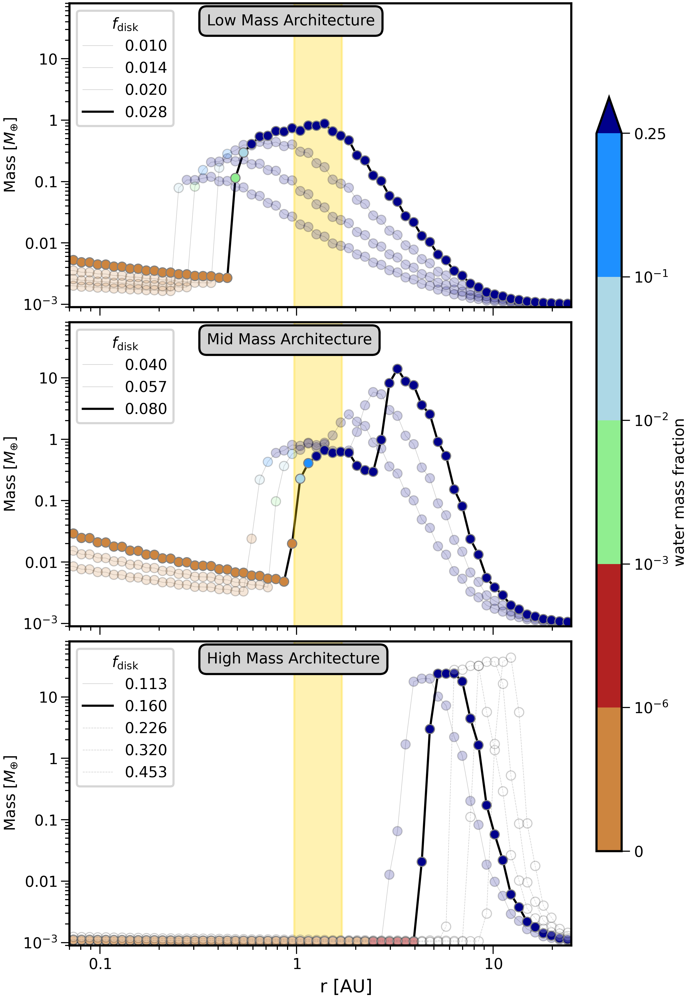

Welcome to the docs for The PPOLs Model - a Python-based planet formation model that explores the "pebble snow" mechanism and its ability to shape planetary system architectures. Improvements to the docs are on-going. Please reach out to S. McCloat via email for questions, code, or links.

The work has been peer-reviewed and **accepted for publication in the Astrophysical Journal (ApJ)**, and will appear in an upcoming volume. You can see `the accepted manuscript on arXiv`_.

.. _the accepted manuscript on arXiv: https://doi.org/10.48550/arXiv.2509.14101

See `license information and credits`_.

.. _license information and credits: https://github.com/spmccloat/thePPOLSmodel/tree/main?tab=readme-ov-file#readme

Plain Language Summary
----------------------
The Solar System has small, rocky planets like Earth near the Sun and large gas giants like Jupiter farther out. For a long time, this was the only planetary arrangement we knew. Now, with thousands of exoplanets discovered, one big mystery is how the Solar System fits into the bigger picture: are we unusual for stars like the Sun? Should Earth-like planets have more or less water? How often do systems have both an Earth-like planet and a Jupiter-like planet?

To explore this, we study how planets form through a process called "pebble accretion". Instead of planets growing only by the cumulative smashing of asteroid-sized rocks, maybe tiny pebble-sized rocks drift toward the star and are collected by growing planets, helping them quickly reach full size.

The PPOLs Model looks at this process over a wide range of stars (some bigger and hotter, and others smaller and cooler than the Sun), considers where those pebbles are dry or contain water, and simulates forming many planetary systems. We found three arrangements of planetary systems were typical: 

1. Several Earth-sized planets close to the star with no gas giants.
2. Only gas giants, farther from the star.
3. A mix of Earth-sized planets and gas giants together - like our Solar System.

This last arrangement only occurred for a narrow range of conditions, suggesting the Solar System blueprint may be uncommon.

   Displaying the mass of planets (y-axis, units of Earth-mass) vs their orbital distance (x-axis, units in au), color-coded by their water content, grown around a 1 solar mass star. Each line connects planets with the same initial disk mass f\ :sub:`disk`, which increases from the "low mass" (top) to "high mass" (bottom) panels.  The architectures separate into a low-mass arrangement (top), with a handful of Earth-mass planets, but no gas giants; a middle-mass arrangement (middle), with both Earth-mass and gas giants; and a high-mass arrangement (bottom), with only gas giant planets. See the full paper for details.

Features of the Model
---------------------

Users can easily set and run planet formation models for a variety of disk models. Major features include:

* protoplanetary disk dust mass that depletes as it converts into pebbles

* temperature profile that can be a simple power law or account for viscous/irradiation heating (e.g. Ida et al. 2016)

* a snow line (water-ice) that can be based on temperature, set explicitly, or self-consistently evolve with disk conditions

* evolving zones where dry vs. water ich pebbles are tracked

* any number of planetesimal seed masses, with any initial mass, introduced at any time

* planetesimal seed masses that grow simultaneously via pebble accretion and remove ("filter") pebble mass as it drifts inward

The model tests outcomes of pebble accretion, specifically during first ~10 million years of the protoplanetary disk when gas is still present. It may serve well as inputs for longer n-body simulations.